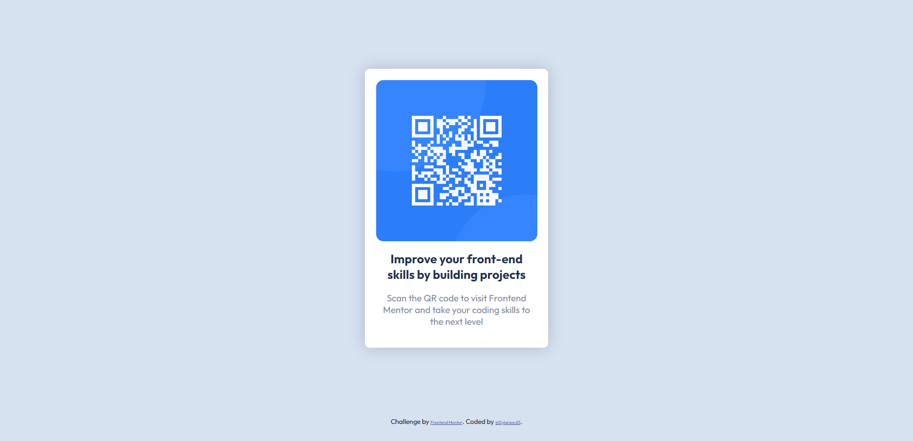

# Frontend Mentor - QR code component solution

This is a solution to the [QR code component challenge on Frontend Mentor](https://www.frontendmentor.io/challenges/qr-code-component-iux_sIO_H). Frontend Mentor challenges help you improve your coding skills by building realistic projects. 
## Overview

### Screenshot



### Links

- Solution URL: [Frontend Mentor - QR code component solution](https://github.com/dylanson25/FrontendMentor/tree/QR-code-component-solution)
- [Live Site URL](https://dylanson25.github.io/FrontendMentor/)

## My process

### Built with

- Semantic HTML5 markup
- CSS custom properties
- Flexbox
- CSS Grid

### What I learned

The goal of a reset stylesheet is to reduce browser inconsistencies in things like default line heights, margins and font sizes of headings, and so on.
To see how you can add code snippets, see below:

```css
* {
    box-sizing: border-box;
    margin: 0;
    padding: 0;
    font-family: "Outfit", sans-serif;
    font-size: 62.5%;
}
```


### Useful resources

-  [CSS Tools: Reset CSS](https://www.example.com) - This helped me to understand how work the reset of HTML.
- [cssreference.io](https://cssreference.io/) - visual guide to CSS. It features the most popular properties, and explains them with illustrated and animated examples.


## Author

- Website - [Dylan Villarreal Toscano](https://github.com/dylanson25)
- Frontend Mentor - [@dylanson25](https://www.frontendmentor.io/profile/dylanson25)
- Twitter - [dylan_toscano_25](https://www.instagram.com/dylan_toscano_25/)


